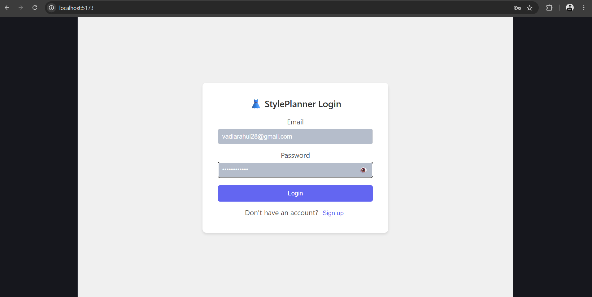
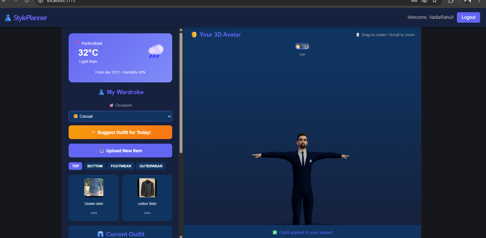
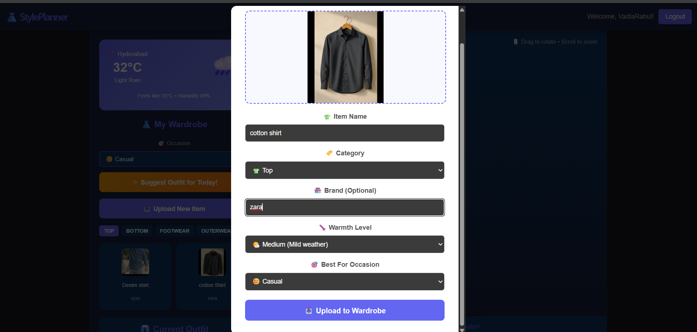
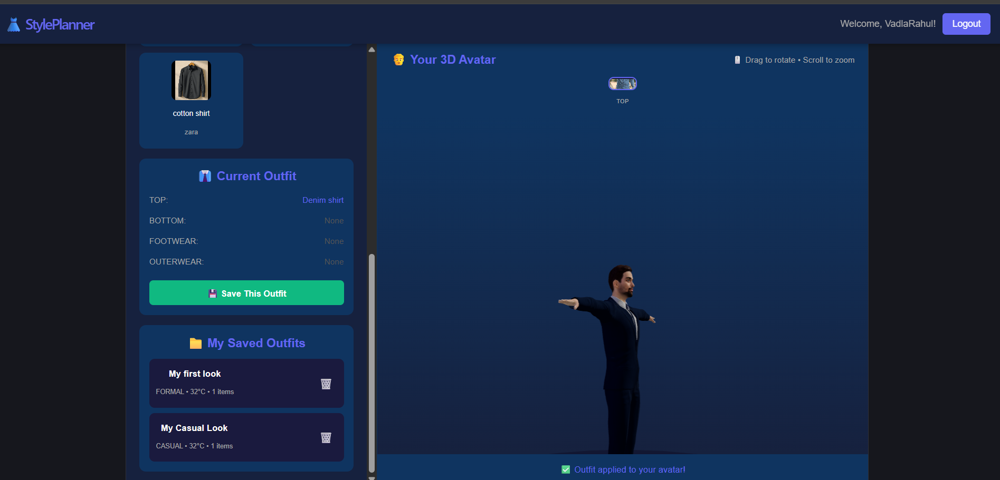

# 👗 StylePlanner — AI-Powered Smart Wardrobe & Outfit Planner

A full-stack web application that lets users create a personalized 3D avatar, upload their wardrobe, and get smart outfit recommendations based on real-time weather and occasion.

## ✨ Features

- 🔐 **Secure Authentication** — JWT-based signup/login with password visibility toggle
- 🧍 **3D Avatar Personalization** — Create a custom 3D avatar using Avaturn integration
- 👗 **Wardrobe Management** — Upload, categorize, and organize clothing items (Top, Bottom, Footwear, Outerwear)
- 🌤️ **Live Weather Integration** — Real-time weather for the user's city via OpenWeatherMap API
- ✨ **Smart Outfit Suggestions** — Algorithm scores wardrobe items by warmth level and occasion to recommend the best outfit for current weather
- 💾 **Save & Load Outfits** — Save outfit combinations with custom names and reload them anytime
- 🎨 **Interactive 3D Viewport** — Rotate, zoom, and view the avatar with React Three Fiber

## 🛠️ Tech Stack

**Frontend:** React (Vite), React Three Fiber, Three.js, Axios
**Backend:** Spring Boot, Spring Security (JWT), Hibernate/JPA
**Database:** MySQL
**External APIs:** Avaturn (3D Avatars), OpenWeatherMap (Weather)

## 📸 Screenshots

| Login | Dashboard |
|-------|-----------|
|  |  |

| Upload Clothing | Saved Outfits |
|------------------|----------------|
|  |  |

## 🚀 Getting Started

### Prerequisites
- Node.js & npm
- Java 17+ & Maven
- MySQL 8+
- OpenWeatherMap API key (free tier)

### Backend Setup
```bash
cd backend
# Configure application.properties with your MySQL credentials and weather API key
mvn spring-boot:run
```

### Frontend Setup
```bash
cd frontend
npm install
npm run dev
```

Visit `http://localhost:5173`

## 🗂️ Project Structure
style-planner/

├── frontend/    # React app

├── backend/     # Spring Boot API

├── database/    # SQL migration scripts

└── docs/        # API & schema documentation
## 🧠 How the Suggestion Algorithm Works

1. Fetches live temperature for the user's saved city
2. Maps temperature to a warmth category (LIGHT / MEDIUM / WARM)
3. Scores each wardrobe item: +10 for warmth match, +5 for occasion match
4. Picks the highest-scoring item per category (Top/Bottom/Footwear/Outerwear)
5. Auto-applies the suggested outfit to the 3D avatar

## 👤 Author

**Vadla Rahul**
[GitHub](https://github.com/VadlaRahul)

---

*This project was built as a personal full-stack learning project, exploring 3D web graphics, third-party API integration, and recommendation algorithms.*